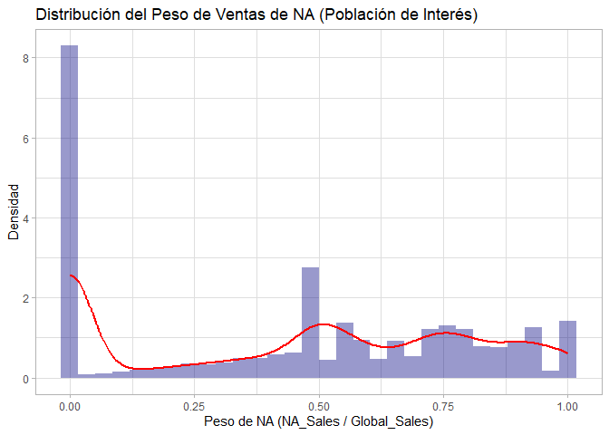
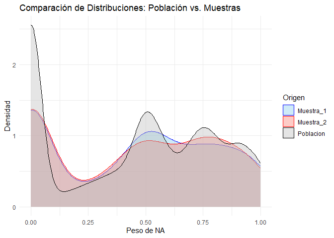

01 Tarea
================
Mónica Isabel Blanco
2025-10-16

\#Librerias

``` r
library(ggplot2)
library(dplyr)
```

    ## 
    ## Attaching package: 'dplyr'

    ## The following objects are masked from 'package:stats':
    ## 
    ##     filter, lag

    ## The following objects are masked from 'package:base':
    ## 
    ##     intersect, setdiff, setequal, union

\#Lectura de datos

``` r
data <- read.csv("vgsales.csv")
summary(data)
```

    ##       Rank           Name             Platform             Year          
    ##  Min.   :    1   Length:16598       Length:16598       Length:16598      
    ##  1st Qu.: 4151   Class :character   Class :character   Class :character  
    ##  Median : 8300   Mode  :character   Mode  :character   Mode  :character  
    ##  Mean   : 8301                                                           
    ##  3rd Qu.:12450                                                           
    ##  Max.   :16600                                                           
    ##     Genre            Publisher            NA_Sales          EU_Sales      
    ##  Length:16598       Length:16598       Min.   : 0.0000   Min.   : 0.0000  
    ##  Class :character   Class :character   1st Qu.: 0.0000   1st Qu.: 0.0000  
    ##  Mode  :character   Mode  :character   Median : 0.0800   Median : 0.0200  
    ##                                        Mean   : 0.2647   Mean   : 0.1467  
    ##                                        3rd Qu.: 0.2400   3rd Qu.: 0.1100  
    ##                                        Max.   :41.4900   Max.   :29.0200  
    ##     JP_Sales         Other_Sales        Global_Sales    
    ##  Min.   : 0.00000   Min.   : 0.00000   Min.   : 0.0100  
    ##  1st Qu.: 0.00000   1st Qu.: 0.00000   1st Qu.: 0.0600  
    ##  Median : 0.00000   Median : 0.01000   Median : 0.1700  
    ##  Mean   : 0.07778   Mean   : 0.04806   Mean   : 0.5374  
    ##  3rd Qu.: 0.04000   3rd Qu.: 0.04000   3rd Qu.: 0.4700  
    ##  Max.   :10.22000   Max.   :10.57000   Max.   :82.7400

\#Preparacion de datos

``` r
data.pobint <- data[data$Global_Sales < 2 & data$Global_Sales > 0, ]
data.pobint$Peso_NA <- data.pobint$NA_Sales / data.pobint$Global_Sales
summary(data.pobint$Peso_NA)
```

    ##    Min. 1st Qu.  Median    Mean 3rd Qu.    Max. 
    ##  0.0000  0.0000  0.5000  0.4537  0.7500  1.0000

\#Graficos

``` r
ggplot(data.pobint, aes(x = Peso_NA)) +
  geom_histogram(aes(y = ..density..), fill = "navy", alpha = 0.4, bins = 30) +
  geom_density(color = "red", linewidth = 1) +
  labs(title = "Distribución del Peso de Ventas de NA (Población de Interés)",
       x = "Peso de NA (NA_Sales / Global_Sales)",
       y = "Densidad") +
  theme_light()
```

    ## Warning: The dot-dot notation (`..density..`) was deprecated in ggplot2 3.4.0.
    ## ℹ Please use `after_stat(density)` instead.
    ## This warning is displayed once every 8 hours.
    ## Call `lifecycle::last_lifecycle_warnings()` to see where this warning was
    ## generated.

<!-- -->
\#Muestreo

``` r
set.seed(123)
muestra_1 <- sample_n(data.pobint,500)
set.seed(42)
muestra_2 <- sample_n(data.pobint, 500)

# Estadísticas básicas de la Muestra 1
cat("--- Estadísticas de la Muestra 1 ---\n")
```

    ## --- Estadísticas de la Muestra 1 ---

``` r
summary(muestra_1$Peso_NA)
```

    ##    Min. 1st Qu.  Median    Mean 3rd Qu.    Max. 
    ##  0.0000  0.0000  0.5000  0.4462  0.7500  1.0000

``` r
# Estadísticas básicas de la Muestra 2
cat("\n--- Estadísticas de la Muestra 2 ---\n")
```

    ## 
    ## --- Estadísticas de la Muestra 2 ---

``` r
summary(muestra_2$Peso_NA)
```

    ##    Min. 1st Qu.  Median    Mean 3rd Qu.    Max. 
    ##  0.0000  0.0000  0.4915  0.4458  0.7500  1.0000

\#Comparacion

``` r
data_combinada <- bind_rows(
  list(Poblacion = data.pobint, Muestra_1 = muestra_1, Muestra_2 = muestra_2),
  .id = "Origen")

# Grafico de comparacion
ggplot(data_combinada, aes(x = Peso_NA, fill = Origen, color = Origen)) +
  geom_density(alpha = 0.4) +
  scale_fill_manual(values = c("Poblacion" = "gray", "Muestra_1" = "skyblue", "Muestra_2" = "salmon")) +
  scale_color_manual(values = c("Poblacion" = "black", "Muestra_1" = "blue", "Muestra_2" = "red")) +
  labs(title = "Comparación de Distribuciones: Población vs. Muestras",
       x = "Peso de NA",
       y = "Densidad") +
  theme_minimal()
```

<!-- -->

\#Conclusion

1.  Al observar las estadísticas descriptivas (`summary`), vemos que la
    media y la mediana de ambas muestras son extremadamente cercanas a
    los valores de la población de interés.Esto valida que el muestreo
    aleatorio es una técnica eficaz para estimar los parámetros
    poblacionales.

2.  El gráfico de densidad comparativo es la prueba visual más fuerte.
    Las curvas de la Muestra 1 y la Muestra 2 siguen casi perfectamente
    la forma de la curva de la población. Esto indica que las muestras
    capturan no solo la tendencia central, sino también la dispersión,
    la asimetría y la forma general de la distribución poblacional.

3.  Al visualizar los gráficos podemos observar que ambas muestras son
    representativas de la población y se puede hacer una inferencia
    correcta, ya que los valores estadísticos son similares o bien
    cercanos a los parámetros. Eso indica que las conclusiones que
    saquemos a partir de la muestra se pueden aplicar a la población.
